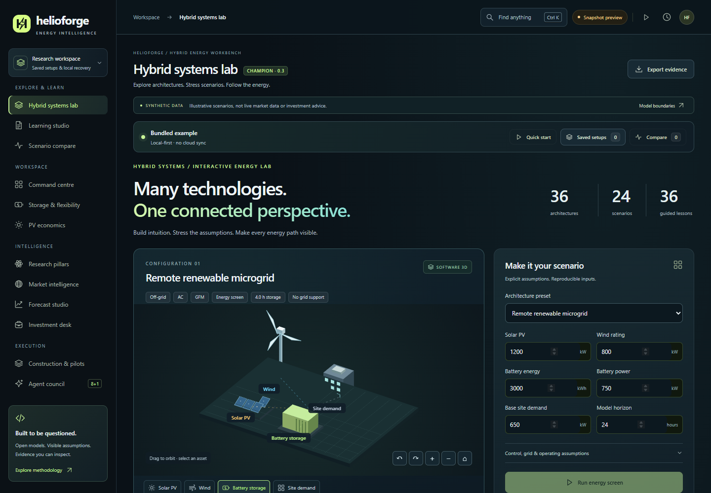
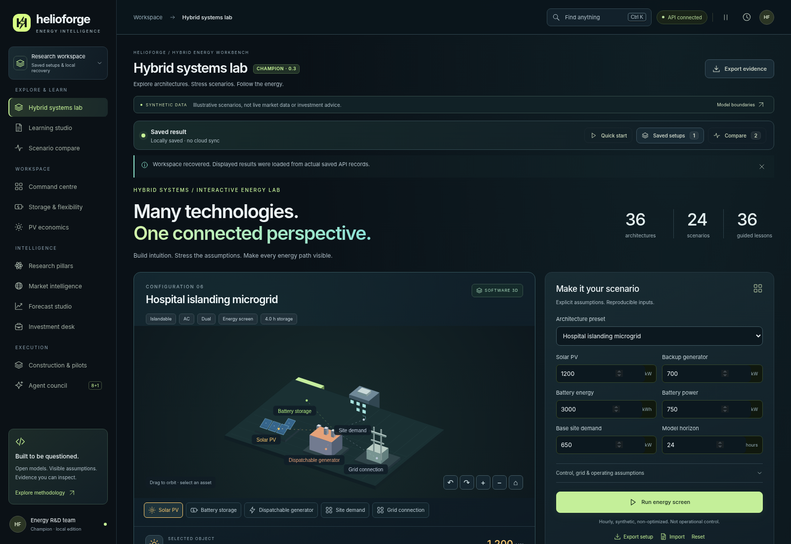
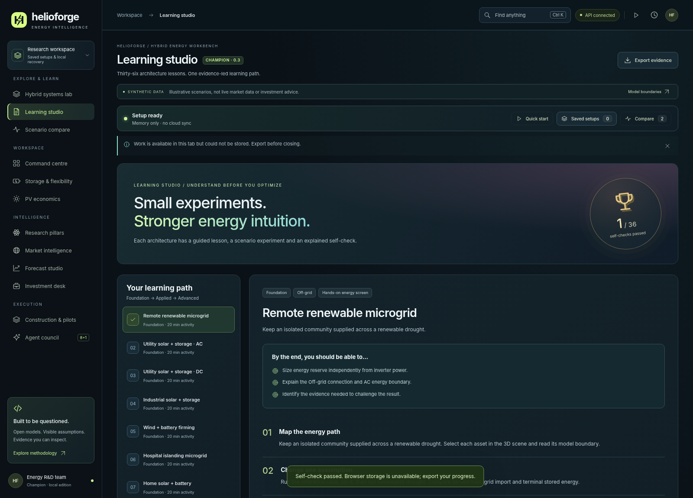
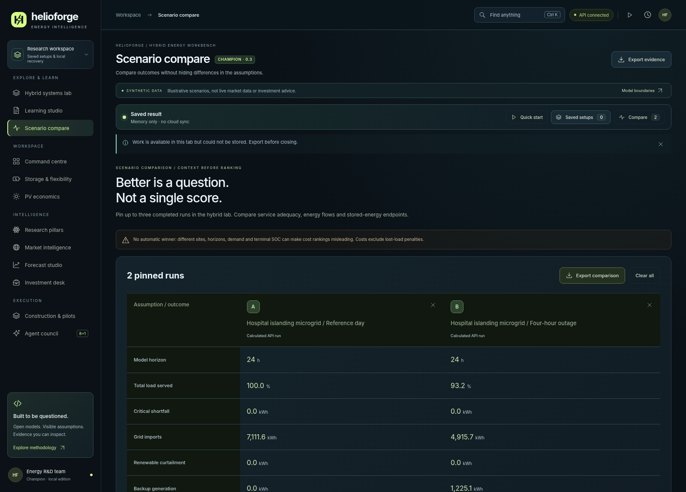

# HelioForge Energy Lab

Interactive hybrid-energy research and learning workbench with auditable numerical screens and a local Python API.

If HelioForge Energy Lab helps you study this workflow, a star helps other energy researchers and engineering educators find it.



## Try the demo

Prerequisite: Node.js 22 or later; tested here with Node.js 24. This runs locally with synthetic examples. It does not connect to a live provider or publish user input.

```sh
git clone https://github.com/mohammadrezwankhan/helioforge-energy-lab.git
cd helioforge-energy-lab
node scripts/preview-demo.mjs
```

Open **http://127.0.0.1:4173**. Stop the server with Ctrl+C. The first screen is a demonstration, not verified current information. Keep private or real-world records out of this evaluation. The standalone preview does not run new Python calculations; use the source guide below for the local API.

## Why inspect this project?

It gives energy researchers and engineering educators a working example of a domain workflow with visible evidence and limitations. Start with the rendered demo, then follow the implementation map in [PROJECT_ANALYSIS.md](PROJECT_ANALYSIS.md). The supplied engineering guide below explains the actual product rules and tradeoffs.

- [Current verification and limits](QUALITY_REPORT.md)
- [Architecture and source map](docs/architecture/system-overview.md)
- [Contribution guide](CONTRIBUTING.md) and [small contribution tasks](docs/CHAMPION_QUESTS.md)
- [Security reporting](SECURITY.md), [support](SUPPORT.md), and [roadmap](ROADMAP.md)

## Develop and verify

Install the Python project with its development extras in an isolated environment; follow the original guide below. HelioForge also has a separately locked web workspace.

```sh
python -m pytest apps/api/tests
python -m ruff check apps/api
npm --prefix apps/web ci
npm --prefix apps/web run build
npm --prefix apps/web test
```

Prior reports under `docs/` describe the supplied candidate. They do not replace the current [quality report](QUALITY_REPORT.md). Passing software checks is not clinical, educational, financial, safety, or production-service validation.

## License and scope

First-party source is available under [MIT](LICENSE). Bundled dependencies retain their upstream notices; trademarks and third-party content are not relicensed.

<details>
<summary>Supplied engineering guide, product boundaries, and detailed usage</summary>

<div align="center">

# HelioForge Champion · 0.3.0
### Explore the architecture. Stress the assumptions. Follow the energy.

**An interactive hybrid-energy laboratory, learning studio and auditable research workspace.**

`36 architectures` · `24 scenarios` · `36 lessons` · `12 workspaces` · `8 + 1 review roles`

[Start here](START_HERE.md) · [Explore the preview](HelioForge-Preview.html) · [Coverage](docs/HYBRID_COVERAGE.md) · [Model limits](docs/HYBRID_METHODOLOGY.md) · [Champion verification](docs/champion/VERIFICATION.md)



</div>

## New in Champion

Named setups, actual saved-run reopening, a keyboard command palette, a guided first experiment, validated workspace recovery and a clearer local-first toolbar. Invalid in-progress hybrid inputs no longer leave stale numerical results visible. Other-model drafts survive navigation, same-market reconnection preserves completed calculations, and a new host allow-list hardens the local boundary. The numerical engines and 36/24/36 catalogue remain unchanged.

**Download/extract → run the platform starter → open the local app.** Prebuilt browser assets are included. See [START_HERE.md](START_HERE.md), [verified changes](docs/champion/VERIFICATION.md), and [release limitations](docs/champion/RELEASE_PLAN.md). “Champion” is the edition name and design ambition, not an award or certification.

## A laboratory that shows its working

Configure an off-grid renewable microgrid, compare a hospital's normal operation with a grid outage, or investigate the model requirements of a hydrogen hub. Rotate the 3D scene, inspect individual assets, edit capacities, run an hourly energy screen and export the exact inputs and results. Then use a guided lesson to explain the outcome—not just admire a chart.

**Scope is visible in the interface:** 19 architectures have runnable electricity-balance screens; 17 advanced architectures are explicitly study-only. There are 20 numerical scenario presets and four dynamic/control study presets. Applicability filtering yields **285 runnable architecture–scenario combinations**, not an indiscriminate 36 × 24 claim. All combinations have energy/SOC invariant tests.

This is an educational and research release. It is **not** a plant controller, an accredited course, a calibrated digital twin, investment advice or a dynamic-stability simulator. The initial battery state is explicit and terminal SOC is unconstrained. A cheaper run that serves less load is not declared the winner.

## What you can do

| Workspace | Working capability |
|---|---|
| **Hybrid systems lab** | Search 36 architectures; inspect original 3D meshes; configure capacities, control assumptions and grid limits; apply scenarios; calculate and export hourly results. |
| **Learning studio** | 36 architecture-linked activities with objectives, experiment steps, evidence requirements and explained two-question self-checks. Local progress, confirmation before reset and exportable lesson plans. |
| **Scenario compare** | Pin up to three completed runs; inspect demand service, imports, curtailment, cost and initial/terminal battery energy. JSON export; no misleading automatic ranking. |
| **Command centre** | Synthetic portfolio search, country filters, overview and evidence export. |
| **Storage & flexibility** | Existing short-horizon SciPy/HiGHS battery MILP with direction and SOC constraints. This is separate from the new greedy hybrid screen. |
| **PV economics / Investment desk** | Existing PV, project-finance and acquisition screens, including debt-free/null states. |
| **Research pillars / Forecast studio** | Existing drift, reliability, lifecycle-carbon and seeded illustrative price calculations. |
| **Market intelligence / Construction & pilots** | Source register, synthetic pilot workflow and persisted evidence events—not live legal or field validation. |
| **Agent council** | Eight deterministic review roles and a critic-style synthesis; local mode is not independently executed agents. Deterministic local mode by default; opt-in OpenAI adapter can review an explicitly selected saved hybrid run. |

### Designed for exploration, not decoration alone

Original low-poly 3D geometry is transformed by a real orthographic camera and rendered in Canvas2D. Drag to orbit, use keyboard or camera buttons, and select assets for text descriptions. This is **software 3D, not WebGL**. Solar, wind, battery, water, hydrogen and other asset categories have distinct colors and named labels. Links animate conceptually; they are not solved branch flows.

The interface includes responsive containers, searchable technology synonyms (`PV`, `BESS`, `H2`), explained tags, smooth view transitions, a reduced-motion switch and system-preference support. A small achievement animation follows a newly passed self-check only; it never implies an engineering approval. New calculations remain disabled in disconnected preview mode.

<table><tr><td></td><td></td></tr></table>

## Start locally

### Fastest: inspect the bundled interface

Open **`HelioForge-Preview.html`** from the extracted repository. It contains the entire interface, original graphics and bundled Python-generated example results with no external font or JavaScript CDN. File-browser policies vary; the locally served application below is the preferred way to use calculations. A GitHub file view shows source rather than running HTML; use the included manual Pages deployment workflow to host a public **preview only**.

### Run calculations

Python **3.11–3.13** is the declared support range; this release was tested here with Python **3.13.5**. Prebuilt browser assets are included, so Node is not required just to run them.

```bash
python -m venv .venv
# macOS/Linux:
source .venv/bin/activate
# Windows PowerShell instead:
# .venv\Scripts\Activate.ps1
python -m pip install -e apps/api
python launch.py
```

Open **http://127.0.0.1:8000**. The server binds to loopback. On Windows, `start-windows.cmd` creates a virtual environment, installs missing pinned runtime dependencies and launches the same local application. It downloads Python dependencies on first use; it does not install Python itself.

Try a useful first experiment: select **Hospital islanding microgrid**, run the baseline, pin it, apply **Four-hour outage**, run again and pin. Open Scenario compare; inspect critical shortfall and terminal battery energy before comparing cost. Names in the versioned catalogue are the source of truth.

### Develop the interface

Node 22 is used by the build configuration. From the repository root:

```bash
cd apps/web
npm ci
npm run typecheck
npm run build
npm test
cd ../..
python -m pytest apps/api/tests
```

After editing the canonical catalogue:

```bash
python scripts/generate-hybrid-assets.py
cd apps/web && npm run build
```

This regenerates browser data from `apps/api/helioforge/data/hybrid_catalog.json`; do not hand-edit `hybrid-data.ts`. To regenerate the original numerical overview snapshot, run `python scripts/generate-snapshot.py` before the web build.

Docker and Compose configuration are retained. They were **not executed during this build**; use the loopback instructions as the verified path. Do not expose this local API publicly without the security hardening in [SECURITY.md](SECURITY.md).

## Model and lesson coverage

The atlas spans grid-connected and off-grid PV/wind/battery systems; remote, residential, community, telecom, hospital, data-centre and industrial sites; hydro, mobility, floating PV, agrivoltaics and electrical desalination loads. Advanced study configurations include hydrogen, CHP, geothermal, thermal storage, heat pumps, V2G, pumped hydro, flywheels, supercapacitors, marine systems, nuclear–hydrogen and coordinated networks. Specialized carrier/network physics are **not implemented** merely because the architecture is shown.

Scenario presets cover weather shortfalls, demand peaks, outages, grid limits, tariffs, battery aging/trips, reserve levels, generator outages and reduced river availability. Black start, reconnection, weak grids and ramp-limit design are marked study-only. The source archive's five cases are mapped in [REFERENCE_MAPPING.md](docs/REFERENCE_MAPPING.md), including separate AC/DC utility-PV entries.

Read [HYBRID_METHODOLOGY.md](docs/HYBRID_METHODOLOGY.md), the full [architecture/scenario matrix](docs/HYBRID_COVERAGE.md), and the [lesson-authoring contract](docs/LESSON_AUTHORING.md) before adding a model.

## Multi-agent review without pretend execution

Local mode is a deterministic checklist—**no LLM is called**. The optional OpenAI Agents SDK adapter runs eight specialists concurrently and then a critic, using structured output, cancellation on error, bounded turns/tokens and a timeout. Set an API model actually available in your own project; product nicknames are not hard-coded as API model identifiers.

External execution is disabled by default and requires server-side credentials, a local admin key and explicit consent. It may incur API charges. Live provider execution was **not tested here**; control flow and failure handling were tested with a fake SDK. See [AI_SETUP.md](docs/AI_SETUP.md) and the [next-build goal prompt](prompts/ASTRA_MULTIAGENT_BETTERMENT.md).

## Current verification

The authoritative v0.3.0 results, failed-attempt history and coverage limitations are in [docs/champion/VERIFICATION.md](docs/champion/VERIFICATION.md). The source changes, local launcher, human-UAT script, recovery notes and file hashes are included. This package has not been deployed or certified for production.

## Historical v0.2.0 verification (baseline only)

**404 Python tests · 65 frontend tests · 32 browser checks** passed in this environment. Python statement coverage is recorded in `docs/coverage.json`; coverage measures exercised code, not scientific validity. The hybrid matrix includes 285 applicable runnable combinations plus 100 seeded capacity/input perturbations. All twelve views passed 390px and 320px page-overflow checks after layout fixes.

Browser tests exercised Chromium DOM/canvas and real API calculations through a host HTTP bridge because direct browser localhost access was restricted. They do **not** certify direct-browser networking, CSP enforcement, file navigation, screen-reader compatibility or field engineering. Read the complete [validation record](docs/VALIDATION.md) and [final audit](docs/FINAL_AUDIT.md).

## Contribute something independently useful

A good contribution adds a reproducible experiment, not just another attractive card. Start with a hand-checkable benchmark, an original lesson, accessible interaction improvements or a clearly licensed time-series fixture. Every new architecture needs a capability declaration; every new numerical claim needs tests and stated units.

[Contributing](CONTRIBUTING.md) · [Good first issues](docs/ROADMAP.md) · [Security](SECURITY.md) · [Code of conduct](CODE_OF_CONDUCT.md) · [MIT license](LICENSE)

**5,000 stars is a community ambition, not a delivered result.** The [open-source launch plan](docs/OPEN_SOURCE_LAUNCH.md) defines usefulness and contribution milestones. No fabricated stars, awards, affiliations, testimonials or adoption statistics are included.


</details>
