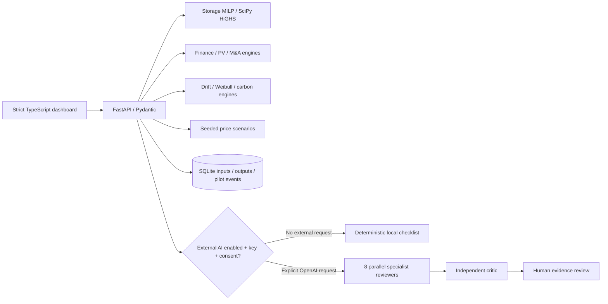

# Architecture

## One browser, one local API, inspectable models

The gate in the diagram describes permission, not a silent fallback: an explicit OpenAI request that fails configuration or consent checks returns an error. It is never relabelled as an actual AI success.

### Boundary decisions

The browser renders inputs and results but does not recreate the finance or dispatch engines in JavaScript. Model requests are validated by Pydantic, computed on the server, persisted with their inputs and returned with warnings. An unsuccessful calculation leaves the user's inputs available for correction.

The frontend uses TypeScript namespaces compiled in a deliberate source order into one classic script. This small local-first release does not need React, a component runtime, a package CDN or client-side numerical packages. It is a trade-off: low installation and dependency cost now, less component/lifecycle infrastructure for a future large team. Move to ES modules or a framework through an explicit architecture decision, not by mixing two competing application controllers.

`SNAPSHOT` is generated from the actual Python models; it is not a second numerical implementation. Its provenance is synthetic. Offline results are read-only and cannot be mistaken for newly solved cases.

### Persistence and model traceability

SQLite stores a run ID, UTC time, model kind, canonical JSON input, SHA-256 input hash and complete output. The hash identifies inputs; it is **not a tamper-evident audit chain** or a substitute for access controls. Pilot updates record old/new state and a mandatory evidence note. Data belongs on the operator's machine; it is not committed to Git.

Current browser edits are session state. Reconnecting, selecting another market or reloading resets forms to that market's defaults. Saved runs remain available in history and can be exported, but restoring arbitrary runs into all forms is not implemented.

### Public API

`GET /api/health`, `/api/overview?market=FR`, `/api/runs`, `/api/runs/{id}`, `/api/pilots`, `/api/pilots/events`.

`POST /api/storage/optimize`, `/api/finance/evaluate`, `/api/pv/evaluate`, `/api/forecast/simulate`, `/api/research/drift`, `/api/research/reliability`, `/api/research/carbon`, `/api/acquisitions/screen`, `/api/council/review`.

`PATCH /api/pilots/{id}` requires a valid stage and evidence note. `/openapi.json` is the machine-readable request contract. All model payloads reject extra fields and nonfinite values.

### Availability and scale

This is a single-user, local-first application. API storage solves are bounded to 168 intervals and a solver time limit. A per-process lock prevents concurrent external council jobs. It is not a global queue or a monetary API budget. There is no job broker, rate limiter, tenancy, managed backup or cluster coordination. Production design must add those deliberately; see SECURITY and ROADMAP.

## Hybrid and learning extension (0.2.0)

`hybrid.py` validates the versioned catalogue/configuration; `engines/hybrid.py` implements the hourly policy. `GET /api/hybrid/catalog`, `POST /api/hybrid/validate` and `POST /api/hybrid/simulate` expose these contracts. The canonical packaged JSON generates browser catalogue/example assets. The frontend adds software-3D scene lifecycle management, architecture/scenario selection, local lesson self-checks and in-memory comparison. No separate browser numerical engine exists.

Only lesson completion IDs use optional localStorage. Hybrid configurations and comparisons are session state with explicit exports. Successful hybrid runs remain in the local SQLite audit store. The council may attach a particular saved hybrid run; the API rejects missing or non-hybrid run IDs.
