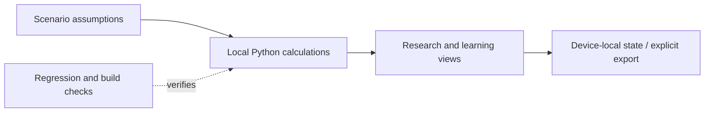

# HelioForge Energy Lab: data and rule boundaries

HelioForge connects a browsable energy-learning interface to an optional local Python calculation API. The standalone preview preserves a reproducible starting point; new numerical runs use the backend and its explicit scenario assumptions.

- `apps/api/helioforge/`
- `apps/web/src/`

This depicts the delivered local workflow. See the engineering case study for the test boundary; it does not assert a hosted production service or external delivery.

The optional loopback Python API computes new numerical results. The standalone preview embeds a snapshot and does not call that API. Provider access stays opt-in as documented in SECURITY.md.
