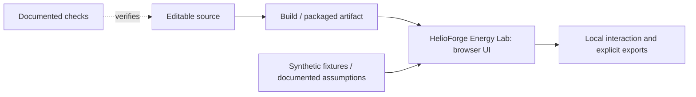

# HelioForge Energy Lab: architecture

Interactive hybrid-energy research and learning workbench with auditable numerical screens and a local Python API.

The diagram covers the delivered demonstration path. It does not imply a production backend or source verification service. The source map below identifies the actual modules; consult their tests before changing a domain rule.

- `apps/api/helioforge/`
- `apps/web/src/`

The portable interface is a snapshot view. The optional Python API performs new numerical calculations; its loopback and opt-in-provider boundaries remain as documented in SECURITY.md.
